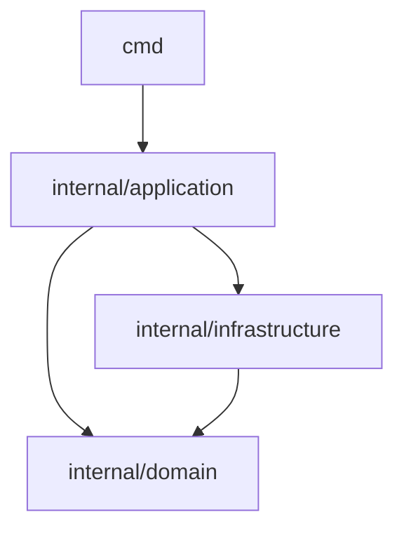

golang-webapi-template
====
The gin-based Web API template. The purpose of this template is for ASP.NET 6+ developers to get used to golang more quickly.

# Requirements

1. [Go 1.19+](https://tip.golang.org/doc/go1.19)
2. [SWAG CLI](https://github.com/swaggo/swag) : Used to generate Swagger files. You can run `swag help` to test.
3. [Visual Studio Code](https://code.visualstudio.com/) (Option) : This template is recommended to use VSCode.
    1. [Go Extension Pack](https://marketplace.visualstudio.com/items?itemName=doggy8088.go-extension-pack) (Recommend) : Popular Visual Studio Code extensions for Go Development.
    2. [Material Icon Theme](https://marketplace.visualstudio.com/items?itemName=PKief.material-icon-theme) (Option) : Material Design Icons for Visual Studio Code. This template has adjustments to the directory and file Icon (see `.vscode/settings.json`).
> ⚠ SWAG CLI currently does not provide Binary files for Windows environment, you need to build it yourself.
> ```shell
> git clone https://github.com/swaggo/swag.git
> cd swag
> go build ./cmd/swag
>
> ./swag help
> ```

# Template Layout

This template is reference to the [Standard Go Project Layout](https://github.com/golang-standards/project-layout).

## Three Layers Struct

This template uses the `Module` approach to slice out three layers of structure: app(`./internal/application`), domain(`./internal/domain`), infra(`./internal/infrastructure`).

* application : This is the Application Layer(Presentation Layer) and works as a gateway where applications interact with the system. This layer processes collected information from interactions between the application and end-users or third-party services. It receives requests and validates the input before sending them to the Domain for processing. API also provides responses to the client. 
* domain : A place to define logic concepts, principles, patterns, and behaviors of data, including domain validation, calculations, and expressions for system operations.
* infrastructure : The Infrastructure of the system includes database, logging, and exceptions. This layer is the place to interact with the database. Through behaviors and rules, POCO classes have been defined in the Domain. This layer undertakes all operations related to the information storage of the system.

> ref. https://enlabsoftware.com/development/domain-driven-design-in-asp-net-core-applications.html

## Modules Dependencies



## Mimicking ASP.NET 6+

In the `./internal/core` module of this template, the flow of WebHost and DepencyInjection in ASP.NET is mimicked. In addition to this, the structure of the Controller is also mimicked as much as possible.

